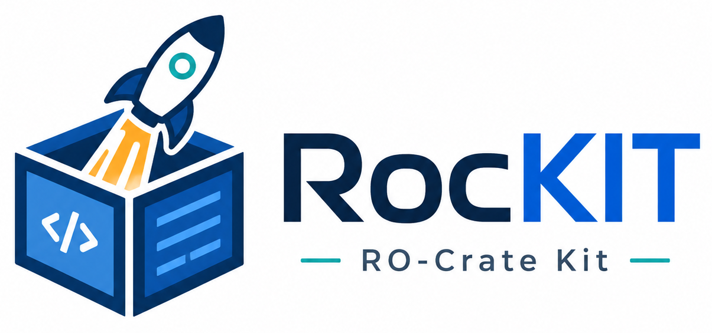
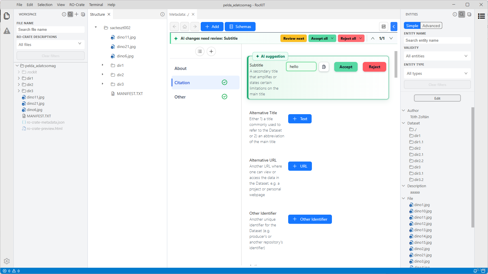
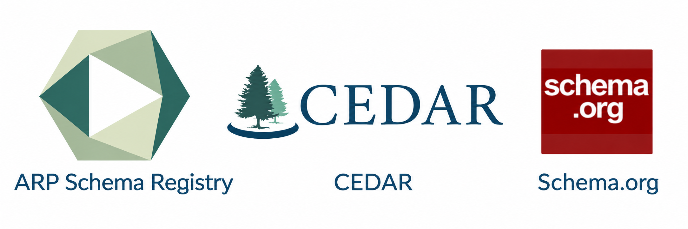
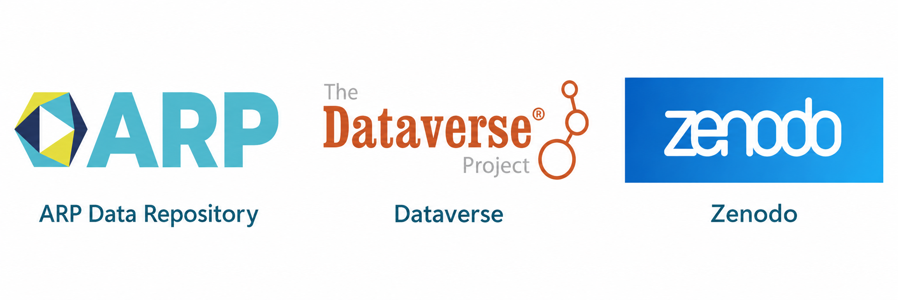
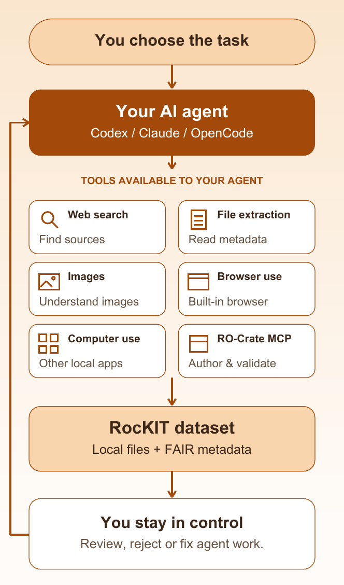
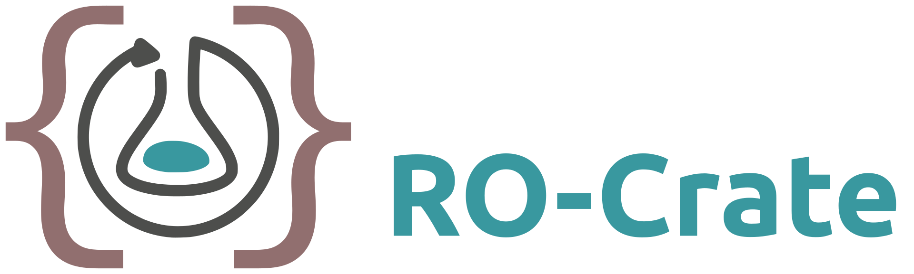
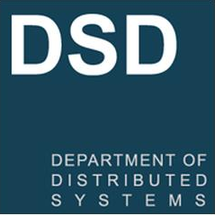

  

<h1 align="center">PRIVATE DESKTOP RO-CRATE EDITOR</h1>

<strong><small>YOUR RESEARCH DATA. YOUR MACHINE. YOUR CONTROL.</small></strong>

Organize local files, add FAIR metadata, validate, package and publish your dataset. Optional AI assistance can help with repetitive tasks while you review, reject or fix every change.

  

## Get RocKIT

Choose your platform to download the latest installer:

<table align="center" width="100%">
  <tr>
    <td align="center" valign="top" width="33.33%">
       
      <strong>Windows</strong> 
      <a href="https://github.com/dsd-sztaki-hu/RocKIT/releases/download/v1.0.10/RocKIT.-.RO-Crate.Kit.Setup.1.0.10.exe">Installer (.exe)</a>
    </td>
    <td align="center" valign="top" width="33.33%">
       
      <strong>macOS</strong> 
      <a href="https://github.com/dsd-sztaki-hu/RocKIT/releases/download/v1.0.10/RocKIT.-.RO-Crate.Kit-1.0.10-arm64.dmg">Apple silicon (.dmg)</a> 
      <a href="https://github.com/dsd-sztaki-hu/RocKIT/releases/download/v1.0.10/RocKIT.-.RO-Crate.Kit-1.0.10.dmg">Intel (.dmg)</a>
    </td>
    <td align="center" valign="top" width="33.33%">
       
      <strong>Linux</strong> 
      <a href="https://github.com/dsd-sztaki-hu/RocKIT/releases/download/v1.0.10/RocKIT.-.RO-Crate.Kit-1.0.10.AppImage">AppImage</a> 
      <a href="https://github.com/dsd-sztaki-hu/RocKIT/releases/download/v1.0.10/electron-app_1.0.10_amd64.deb">Debian/Ubuntu (.deb)</a>
    </td>
  </tr>
</table>

<small>Looking for older versions or all release files? <a href="https://github.com/dsd-sztaki-hu/RocKIT/releases">Browse RocKIT releases on GitHub</a>.</small>

## Workflow

<strong>From local files to a research dataset.</strong>

Organize, describe, validate, review and package. Publish when you are ready.

1. **Organize** — Open a folder or an existing RO-Crate. Work with files on your machine.
2. **Describe** — Add FAIR metadata freely, or follow a profile for your research domain.
3. **Validate & review** — Check requirements and inspect the metadata before sharing.
4. **Package** — Export your dataset as an RO-Crate ZIP, with data and metadata together.
5. **Publish** — Choose a repository. Deposit or update through supported integrations.

**Your entire workflow in RocKIT.** RocKIT supports every step, from local files to publishing your research dataset.

## Metadata

**Describe it your way.** Choose fields from available schemas. Import profiles to guide metadata editing and validation for your research dataset.

- **Choose schema elements:** Use the terms your dataset needs.
- **Import a profile:** Follow its required fields and rules.
- **Edit & validate:** Complete and check your metadata.

RocKIT imports CEDAR templates from the ARP Schema Registry. You can also add individual fields from schema vocabularies such as Schema.org.

  

## Repositories

**Prepare locally. Share when ready.** Keep authoring local, package your RO-Crate, or use a supported repository to deposit and maintain your dataset.

  

1. **Bring a dataset in:** Import a remote dataset as a local RO-Crate.
2. **Work on your computer:** Edit descriptions, review files and validate metadata.
3. **Send a reviewed package:** Create or update a deposit in your chosen repository.

> **One package, two parts.** Your research files and their linked metadata travel together in an RO-Crate ZIP.

## Agent assistance

**Less repetition. You stay in control.** Use Codex, Claude or OpenCode. RocKIT provides an RO-Crate MCP server with tools to author and validate RO-Crates.

Available agent tools include web search, file extraction, image understanding, browser use, computer use and RO-Crate authoring and validation through MCP. Your agent works with a RocKIT dataset—local files and FAIR metadata. You choose the task and stay in control: review, reject or fix the agent's work.

  

## Built on RO-Crate

  

## Contact & team

Contact the RocKIT team at [rockit@dsd.sztaki.hu](mailto:rockit@dsd.sztaki.hu) or visit [dsd.sztaki.hu](https://dsd.sztaki.hu).

   
  SZTAKI · Department of Distributed Systems

## License

RocKIT is licensed under the Apache License, Version 2.0. See [LICENSE.md](LICENSE.md) for details.

Additional attribution and bundled third-party component information is available in
[NOTICE](NOTICE) and [THIRD-PARTY-NOTICES.md](THIRD-PARTY-NOTICES.md).

<small>Copyright © 2026 HUN-REN SZTAKI, DSD</small>

